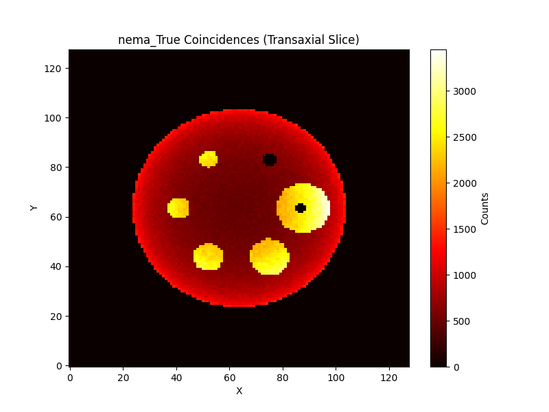
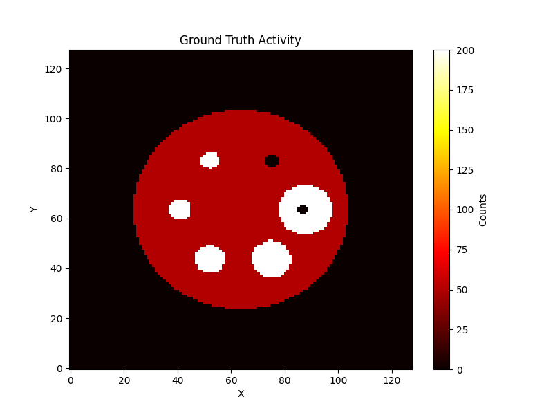
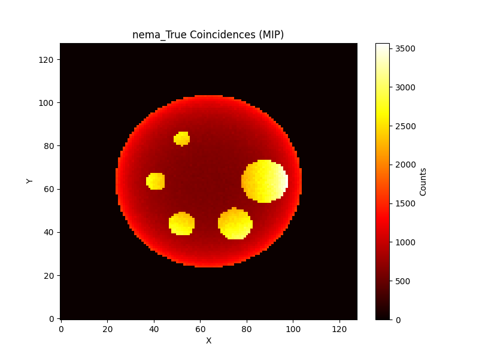
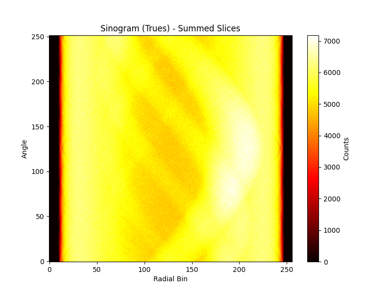
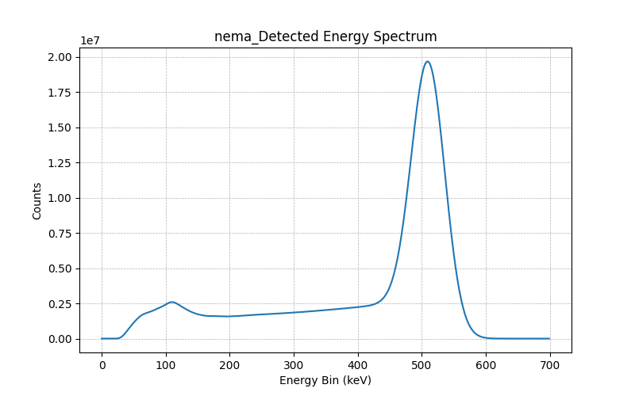
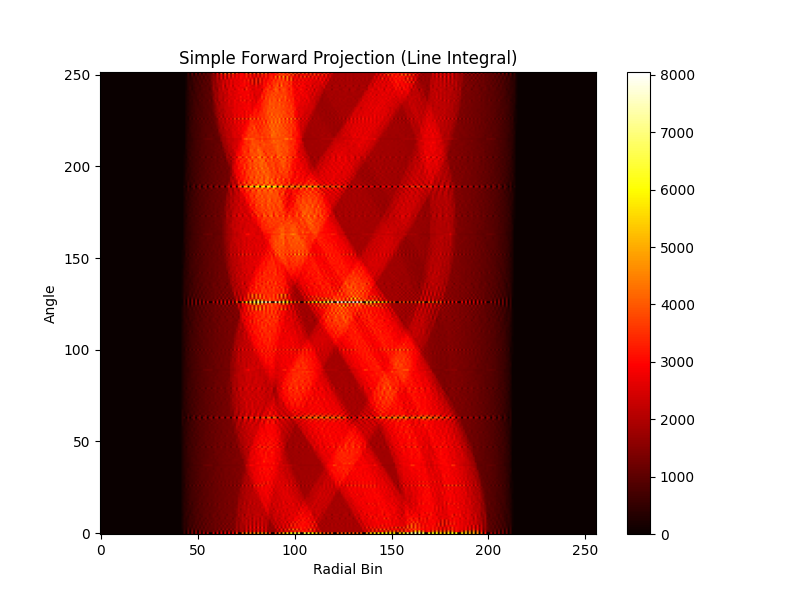
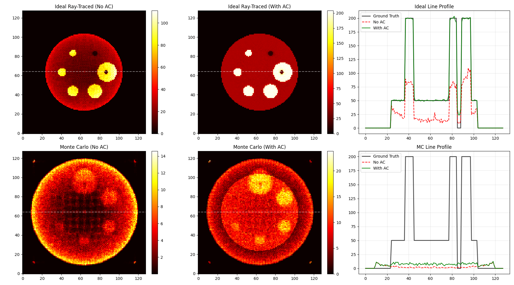
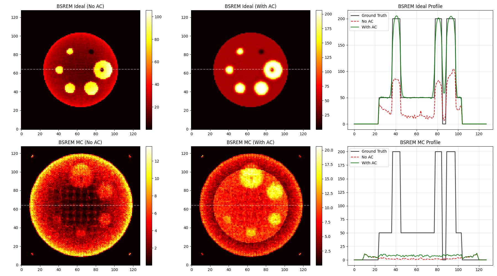
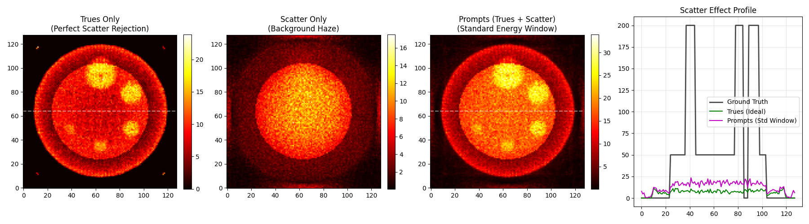
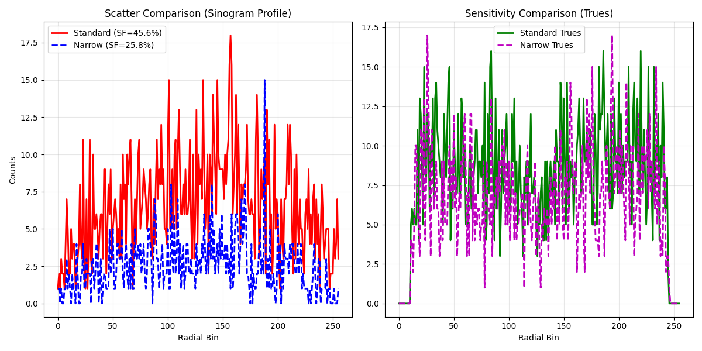

# MC-GPU-PET Demo Guide

This guide explains how to run the provided demonstrations for MC-GPU-PET.

## 1. Simple Demo (Water Cube)
A basic simulation of a small water cube with 3 hot sources. Runs in a few seconds.

**Steps:**
1.  Navigate to the `sample_simulation` directory:
    ```bash
    cd sample_simulation
    ```
2.  Run the simulation executable with the input file:
    ```bash
    ./MCGPU-PET.x MCGPU-PET.in
    ```
3.  **Visualization:**
    Run the Python visualization script (from the `scripts` directory):
    ```bash
    cd scripts
    python3 visualize_results.py
    ```

**Results:**

| True Coincidences Image | Energy Spectrum |
|:---:|:---:|
|  |  |
| *Central slice showing the 3 hot sources.* | *Energy spectrum showing 511 keV peak.* |

---

## 2. Advanced NEMA IEC Phantom Demo
A realistic simulation of the NEMA IEC Body Phantom (20cm water cylinder with 4 hot and 2 cold spheres) at 128x128x128 resolution.
**Enhanced**: Includes an additional **Extra Large Hot Sphere** (5cm diameter) and runs for 120s acquisition.

**Prerequisite:**
You must first generate the voxel phantom file.
```bash
make run-nema
```
(This command generates the phantom and runs the simulation automatically).

**Manual Steps:**
1.  Generate phantom: `python3 sample_simulation/scripts/generate_nema_phantom.py`
2.  Move to simulation dir: `mv nema_iec_128.vox sample_simulation/`
3.  Run simulation: `./MCGPU-PET.x NEMA_IEC.in` (in `sample_simulation/`)

**Visualization:**
Run the visualization script with the `nema` argument:
```bash
cd sample_simulation/scripts
python3 visualize_results.py nema
```

**Results:**

| NEMA True Coincidences | Ground Truth Activity |
|:---:|:---:|
|  |  |
| *Transaxial Slice (XY) of True events.* | *Ground truth transaxial activity map (Slice 64).* |

| NEMA MIP (Z-Axis) | NEMA Sinogram |
|:---:|:---:|
|  |  |
| *Maximum Intensity Projection (XY).* | *Sinogram (Summed Planes).* |


*Detected energy spectrum.*


---

## Makefile Commands
You can also use the `Makefile` in the root directory to run these steps conveniently.

- **`make`**: Compiles the code.
- **`make run-nema`**: Generates the NEMA phantom (if missing) and runs the NEMA simulation.
- **`make help`**: Displays available commands.

---

## 3. Reconstruction & Comparison
This section compares the **Monte Carlo simulation** (realistic physics) against the **Legacy Recon Demo** (simplified ray-tracing).

### A. Forward Projection Comparison
We projected the Ground Truth phantom using a **simplified line-integral system matrix** (Legacy method) and compared it to the **Monte Carlo sinogram**.

| Sinogram Comparison | Profile Lineout (Angle 63) |
|:---:|:---:|
|  |  |
| *Simplified Forward Projection (Geometry Only).* | *Comparison of Sinogram Profiles.* |

**Observation**: The Monte Carlo profile (orange) is wider and has a "tail" compared to the ideal geometric profile (blue). This is due to **Scatter** (photons deviating from straight lines), **Positron Range**, and **Detector Blurring**, which are physically modeled in MC-GPU but ignored in the simplified projector.

### B. Image Reconstruction (OSEM vs BSREM)
We reconstructed both **Ideal Ray-Traced Data** (Top Row) and **Monte Carlo Data** (Bottom Row) using OSEM and BSREM.
**Attenuation Correction (AC)** was tested on both datasets.

| OSEM Reconstruction | BSREM Reconstruction |
|:---:|:---:|
|  |  |
| *Top: Ideal Data. Bottom: Monte Carlo Data.* | *Left: No AC. Mid: With AC. Right: Profile.* |

**Analysis**:
1.  **Top Row (Ideal)**: With AC (Green), the reconstruction is perfect. Without AC (Red), the "cupping" artifact is purely due to uncorrected attenuation.
2.  **Bottom Row (Monte Carlo)**: Even with AC, the image is noisy and has a "scatter tail" (Background > 0) because we are not correcting for Scatter physics yet.
3.  **Profile**: The line profiles quantitatively show how AC restores the signal in the center of the phantom.

**Note**: Since we do not correct for Scatter, the center of the image may still be over-estimated even with AC, or the background may be non-zero.

### C. Scatter & Energy Windowing Analysis
The simulation applies an energy window (350-600 keV) to reject scattered photons. However, some photons still scatter and fall within this window.
Since we cannot change the energy window post-simulation, we demonstrate the maximum effect of **Scatter Rejection** by comparing:
1.  **Prompts (Trues + Scatter)**: Represents a standard acquisition (Scatter Fraction $\approx$ 44%).
2.  **Trues Only**: Represents a "Perfect" energy window that rejects all scatter.


*Left: Trues Only (Ideal rejection). Middle: Scatter Only. Right: Prompts (Standard Window).*

**Observation**: The **Scatter Only** image shows a low-frequency background "haze". When added to the Trues (Prompts), it reduces contrast and adds a background bias (magenta line in profile), illustrating why narrow energy windows or scatter correction algorithms are critical.

### D. Energy Window Optimization
To further investigate scatter rejection, we ran a second simulation with a **Narrow Energy Window** (450-550 keV) and compared it to the Standard Window (350-600 keV).

| Window Setting | Range (keV) | Scatter Fraction | Impact |
| :--- | :--- | :--- | :--- |
| **Standard** | 350 - 600 | **44.4%** | High sensitivity, but significant scatter haze. |
| **Narrow** | 450 - 550 | **24.8%** | Reduced scatter, but ~30% lower sensitivity (fewer Trues). |


*Left: Scatter profiles show significant reduction in background with the narrow window. Right: Trues sensitivity is slightly reduced, illustrating the trade-off.*

### E. Method Comparison Table

| Feature | Legacy Recon Demo (Ray Tracer) | MC-GPU-PET (Monte Carlo) |
| :--- | :--- | :--- |
| **Method** | Geometric Line Integrals (Radon Transform) | Stochastic Particle Transport |
| **Physics** | None (Geometry only) | Complete (interactions, cross-sections) |
| **Attenuation** | Analytical `exp(-sum(mu))` (optional) | Explicit photon absorption/loss |
| **Scatter** | None (perfect straight lines) | Compton & Rayleigh scattering modeled |
| **Detector** | Perfect binning | Crystal penetration, Energy resolution, Dead-time |
| **Positron** | Point source approximation | Positron range & Non-collinearity |
| **Speed** | Extremely Fast (ms) | Computationally Intensive (mins/hours) |
| **Use Case** | Algorithm development, Educational basics | Realistic Scanner Design, Protocol optimization |

The goal of this demo is to bridge the gap: using **MC-GPU** to generate realistic data, and then applying reconstruction algorithms to understand how images are formed from that data.
