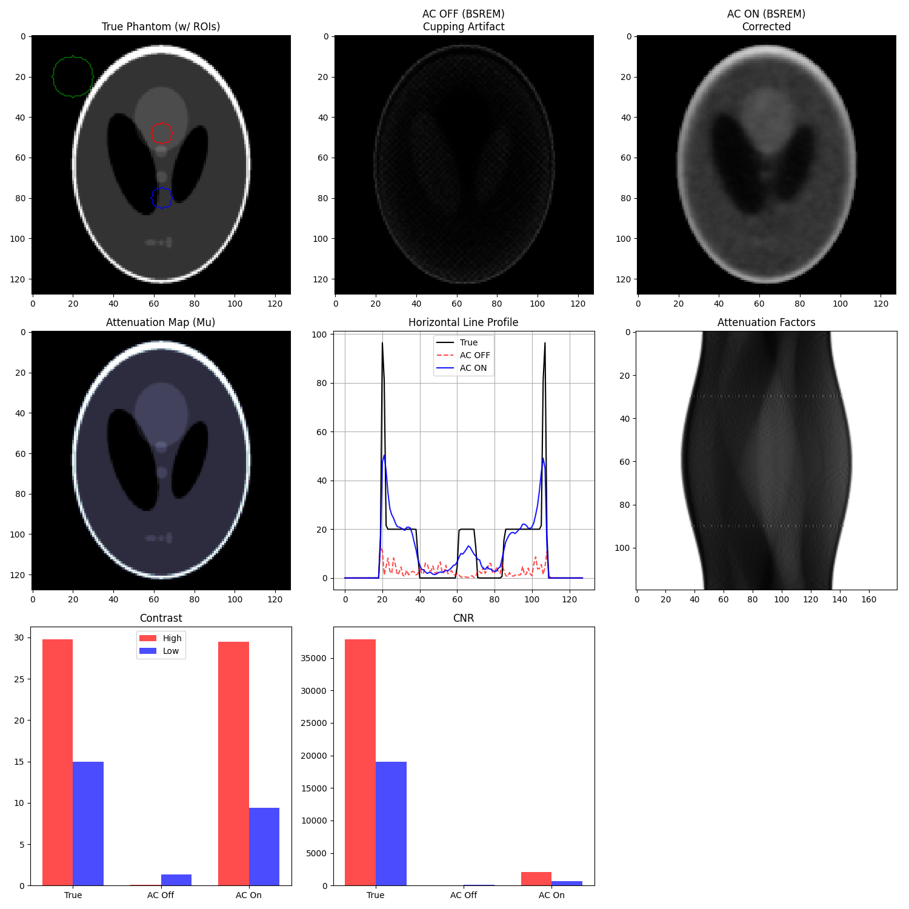
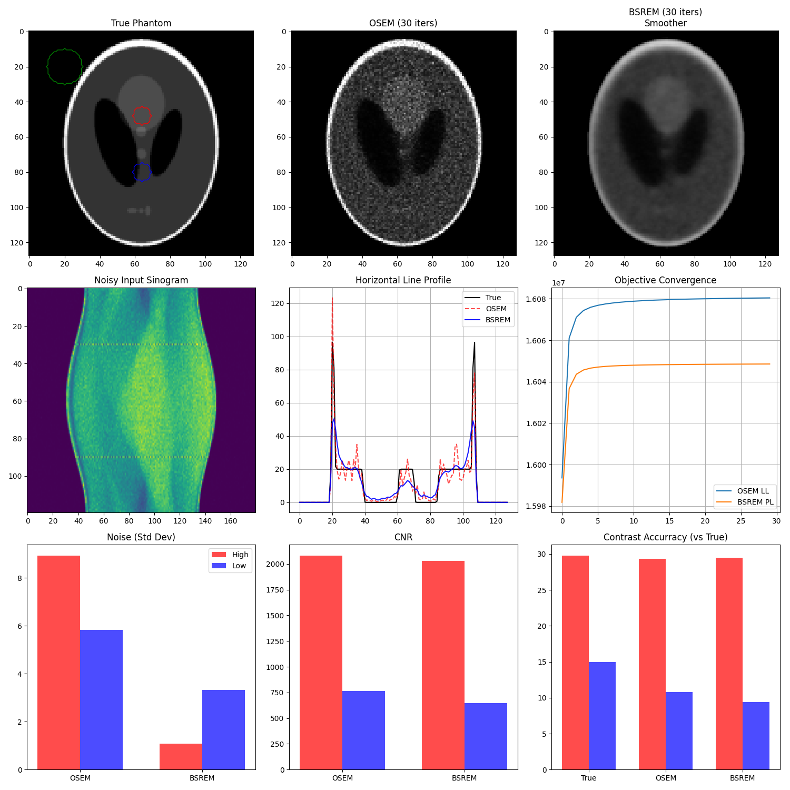

# Toy PET Reconstruction Demo

This project demonstrates the principles of **Positron Emission Tomography (PET)** image reconstruction, specifically focusing on **Iterative Reconstruction** methods (OSEM and BSREM). It uses a simplified 2D simulation to illustrate the impact of **regularization** and **attenuation correction**.

## Overview

The script `bsrem_demo.py` is the main entry point. It uses a modular structure (in `recon/`) to perform:
1.  **System Matrix Generation**: Creates a sparse matrix $A$ representing the geometry of a PET scanner.
2.  **Data Simulation**:
    -   Starts with a "Ground Truth" phantom (Shepp-Logan).
    -   Generates an **Attenuation Map ($\mu$-map)**.
    -   Simulates forward projection with **Attenuation Loss**: $E[y] = (A \lambda) \cdot e^{-\int \mu} + r$.
    -   Adds Poisson noise to create a realistic noisy sinogram.
3.  **Reconstruction**:
    -   **OSEM**: Standard Ordered Subsets Expectation Maximization.
    -   **BSREM**: Block Sequential Regularized Expectation Maximization (Penalized Likelihood).
    -   **AC (Attenuation Correction)**: Compensating for photon absorption.

## Results

### 1. Attenuation Correction Analysis
Without Attenuation Correction (AC), PET images suffer from significant artifacts. Photons from the center of the object traverse more tissue and are more likely to be absorbed than photons from the edge.



**Discussion**:
*   **AC OFF**: Note the "Cupping Artifact" in the line profile (Red dashed line). The center of the phantom appears overly dim because the reconstruction algorithm assumes all detected counts came from a transparent object, not realizing many were lost to attenuation.
*   **AC ON**: The Blue profile matches the True (Black) profile much better. The flat intensity regions are recovered.

### 2. Algorithm Comparison (OSEM vs BSREM)
Iterative algorithms like OSEM converge to the noisy data (Maximum Likelihood), leading to "salt and pepper" noise in later iterations. BSREM adds a roughness penalty to enforce smoothness.



**Discussion**:
*   **OSEM**: High noise in the high-contrast regions (Red bars in the Noise plot). The image looks grainy.
*   **BSREM**: Significantly lower noise (Blue bars) while maintaining sharp edges (Contrast). The regularization successfully suppresses the noise amplification common in OSEM.

## Simplifications vs Real PET Systems

This "Toy System" makes several simplifications:
1.  **Geometric Only**: Uses simple line integrals; ignores detector width/depth and Point Spread Function (PSF).
2.  **2D vs 3D**: Simulates a single slice; real PET is volumetric with complex sensitivity profiles.
3.  **No Scatter**: Ignores Compton scattering (photons changing direction), which adds ~30-50% background haze.
4.  **No Randoms**: Ignores accidental coincidences.
5.  **Perfect Mu-Map**: We derived the $\mu$-map directly from the emission phantom, avoiding the complex registration issues seen in real PET/CT.

## Usage

Run the script to generate the figures:
```bash
python bsrem_demo.py
```
This will create `demo_attenuation_comparison.png` and `demo_recon_comparison.png` in the current directory.
